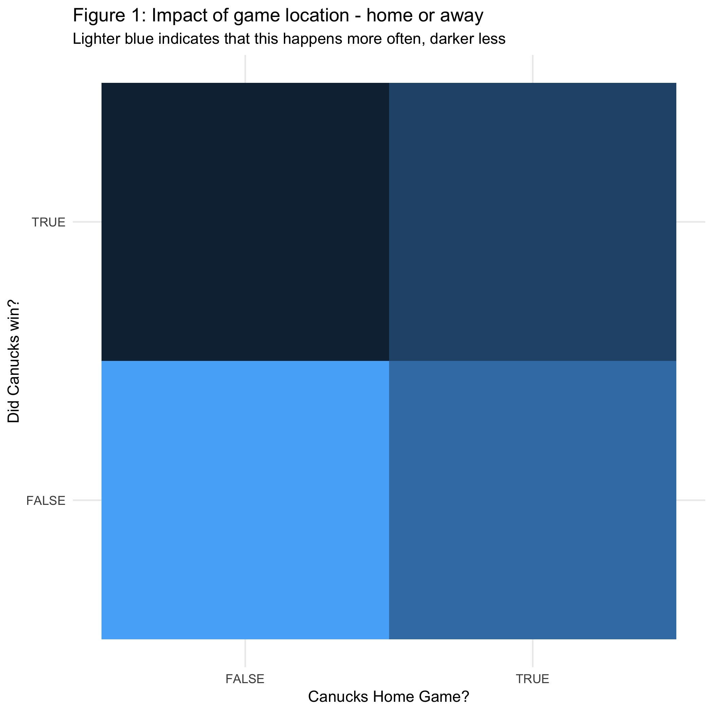
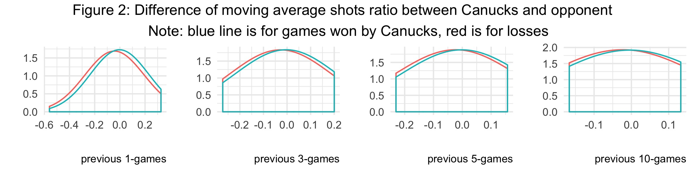
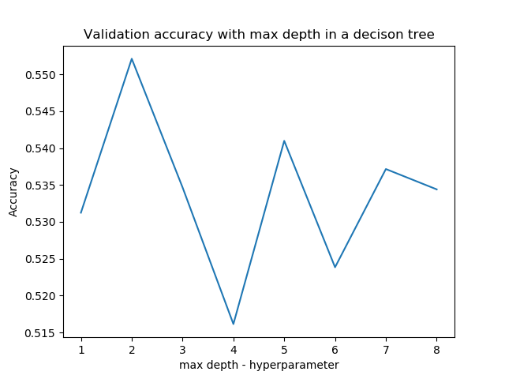

Results of NHL Prediction Model
================
Shayne Andrews & Aditya Sharma
November 2018

Introduction
------------

NHL hockey games are notoriously difficult to predict. There is [common acceptance](https://www.nhlnumbers.com/2013/08/01/machine-learning-and-hockey-is-there-a-theoretical-limit-on-predictions) among hockey analytics enthusiasts that it is not possible to do better than 62% accuracy (i.e. 38% is due to luck). Interestingly, the NHL has recently [announced a partnership](https://www.nhl.com/news/nhl-mgm-resorts-sports-betting-partnership/c-301392322) with MGM Resorts to enable sports betting.

> Could we do better than 62% accuracy using supervised machine learning?

The Question
------------

**Will the Vancouver Canucks win or lose their next game?**

We simplify the analysis here by focusing on a single team (Canucks), although we still need to consider data on all of the other teams as an opponents for each prediction. In the future we would like to extend the model to allow predictions for any team, and to investigate whether a single model for all teams performs better/worse than separate models for each team.

The Data
--------

The NHL has committed to providing detailed player tracking data starting next season, but in the meantime, we will see how accurate we can be with less granular data. Actually the data we are use here is *very* basic, but we are building a reproducible pipeline here which will allow us to easily expand the model in the future.

Plenty of data is available publicly on the [NHL website](www.nhl.com), but we've managed to avoid scraping ourselves and obtained the data directly from [Martin Ellis on Kaggle](https://www.kaggle.com/martinellis/nhl-game-data).

Notably, this data includes all games starting with the 2012-13 season through the end of the 2017-18 season. We've excluded the 2012-13 season from the model for two reasons: 1) this was a lockout-shortened season, and 2) it is older data and not as relevant for future predictions. Alse we exclude playoff and pre-season games and use only the regular season.

There are several tables of interest, but we have focused exclusively on `game_teams_stats.csv`, with the following key variables driving our prediction:
- Did the team of interest win the game? (won column, TRUE/FALSE)
- Home or Away game? (HoA column, home/away)
- Who is the opponent? (team\_id column, 1-31)
- What proportion of *goals* were scored by the team of interest? (calculated using goals column for both teams, 0-1)
- What proportion of *shots* were made by the team of interest? (calculated using shots column for both teams, 0-1)
- What proportion of *shots* were *saved* by the team of interest? (calculated using goals and shots columns, 0-1)

However, when predicting game results we don't know the goals/shots/saves in advance from the game we're trying to predict. So we will look backwards, and see if we can use these stats from previous games for both teams to make better predictions. In particular, we will use 1-, 3-, 5-, and 10-game averages for `won_ratio`, `goals_ratio`, `shots_ratio`, and `save_ratio`. One side effect of this is that we must "throw away" the first 10 games of each season as we don't want to be looking back into the previous season to make these predictions.

In addition to the above ratios for each team, we have engineered an additional *difference* feature which is the ratio for the Canucks minus the ratio for their opponent. The idea here is that it will give the decision tree a sense of the relative strength of both teams together in one feature.

So we have 72 games in each of 5 seasons, 360 games in total for the Canucks. We are splitting this data into train/test by season rather than randomly. For a prediction such as this, we want to train the model looking backwards and test the model looking forwards. So we will do this as if we are standing at the beginning of the 2017-18 season, and put that season of data aside to test our final model.

Some observations about our data (specifically on the training data):

We can see in Figure 1 that when the Canucks are on the road they are far more likely to lose the game. This makes sense and supports the commonly accepted idea of "home ice advantage".

  

We can see in Figure 2 that there isn't a huge difference in shot ratio difference as a predictor of wither the Canucks win or lose there next game, but there is a bit. Using only the previous 1 game appears to be slightly better than the others.

The Model
---------

We looked at many different combinations of features and used 10-fold cross validation on our training data to choose features and hyperparameters. We also considered both a single decision tree model, and a random forest which should be a bit more robust.

In the end, we included the top 12 features using the `feature_importances_` attribute in the `sklearn` decision tree. They are as follows (in descending order of importance):
- `goals_ratio_prev10.x`
- `goals_ratio_prev3.y`
- `save_ratio_prev10.diff`
- `shots_ratio_prev3.y`
- `shots_ratio_prev3.x`
- `shots_ratio_prev1.y`
- `save_ratio_prev3.diff`
- `shots_ratio_prev5.y`
- `goals_ratio_prev5.x`
- `goals_ratio_prev10.diff`
- `team_id.y`
- `goals_ratio_prev3.diff`

Note: those ending in `.x` are for the Canucks, `.y` is their opponent, and `.diff` is the difference between the two.

Testing out some different depths it is clear that we are overfitting if we go beyond depth 3 or 4 on a decision tree.

Looking at both decision trees and random forests ([full results here](https://github.com/UBC-MDS/DSCI-522_nhl-game-predictor/blob/master/results/model_selection.csv)), we get optimal depth of 2 on with cross validation accuracy of 55.2% on a decision tree and depth of 1 on a random forest with **cross validation accuracy of 58.8%**.

So we go forward with the **depth 1 random forest** prediction model. (number of trees = 500)

The Results
-----------

Re-training this model on the entire training set and then testing our prediction accuracy on the test set (2017-18 season), we get a **test accuracy of 60.6%** ([see here](https://github.com/UBC-MDS/DSCI-522_nhl-game-predictor/blob/master/results/final_result.csv)). This is a little surprising to have a better test accuracy than training, and we think it is due to some bias in the small test data (only 72 games). We need to do some more testing on other teams to be more confident in our model.

In any case, the accuracy is not great but is close to the suggested 62% maximum. We are only using very basic data and came close to this mark, so if we perhaps were to look at which players are playing (e.g. injuries, backup goalie?) and whether each team had enough rest between games (back-to-backs are common and create some unfairness). Player tracking data could be especially helpful for predictions.

References
----------

Data: <https://www.kaggle.com/martinellis/nhl-game-data>
Lags and Moving Means in dplyr: <https://danieljhocking.wordpress.com/2014/12/03/lags-and-moving-means-in-dplyr/>
62% accuracy cap for NHL predictions: <https://www.nhlnumbers.com/2013/08/01/machine-learning-and-hockey-is-there-a-theoretical-limit-on-predictions>
